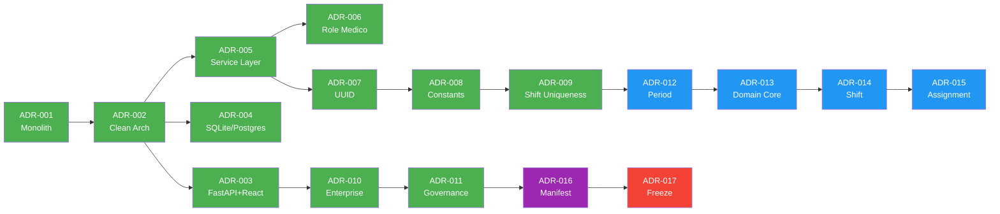

# Architecture Decision Timeline — Plantão 360

**Date:** 2026-06-26
**Sprint:** 5.2

---

## Timeline

---

## ADR Details

| ADR | Title | Sprint | Status | Dependencies |
|-----|-------|--------|--------|--------------|
| ADR-001 | Monolito Modular | 0 | Accepted | - |
| ADR-002 | Clean Architecture | 0 | Accepted | ADR-001 |
| ADR-003 | FastAPI + React | 0 | Accepted | ADR-002 |
| ADR-004 | SQLite/PostgreSQL | 0 | Accepted | ADR-002 |
| ADR-005 | Service Layer | 1 | Accepted | ADR-002 |
| ADR-006 | Role Médico | 1 | Accepted | ADR-005 |
| ADR-007 | UUID | 1 | Accepted | ADR-005 |
| ADR-008 | Domain Constants | 1 | Accepted | ADR-007 |
| ADR-009 | Shift Uniqueness | 1 | Accepted | ADR-008 |
| ADR-010 | Enterprise Patterns | 2A | Accepted | ADR-003 |
| ADR-011 | Platform Governance | 2.8 | Accepted | ADR-010 |
| ADR-012 | Period Aggregate | 3 | Accepted | ADR-009 |
| ADR-013 | Domain Core | 3.1 | Accepted | ADR-012 |
| ADR-014 | Shift Aggregate | 4 | Accepted | ADR-013 |
| ADR-015 | Assignment Domain | 5 | Accepted | ADR-014 |
| ADR-016 | Module Manifest | 5.1 | Accepted | ADR-011 |
| ADR-017 | Engineering Freeze | 5.2 | Accepted | ADR-016 |

---

## Decision Categories

### Foundation (Sprint 0)
- ADR-001: Monolith architecture
- ADR-002: Clean Architecture layers
- ADR-003: Tech stack selection
- ADR-004: Database strategy

### Infrastructure (Sprint 1-2)
- ADR-005: Service layer pattern
- ADR-006: Medical entity modeling
- ADR-007: UUID strategy
- ADR-008: Domain constants
- ADR-009: Shift uniqueness rules
- ADR-010: Enterprise patterns

### Governance (Sprint 2.8-5.1)
- ADR-011: Platform governance
- ADR-016: Module manifest system

### Domain (Sprint 3-5)
- ADR-012: Period aggregate
- ADR-013: Domain core
- ADR-014: Shift aggregate
- ADR-015: Assignment domain

### Freeze (Sprint 5.2)
- ADR-017: Engineering freeze

---

## Impact Analysis

### High Impact ADRs
- ADR-001 (Monolith): Defines entire architecture
- ADR-002 (Clean Arch): Defines layer separation
- ADR-013 (Domain Core): Defines shared domain logic
- ADR-017 (Freeze): Locks infrastructure

### Medium Impact ADRs
- ADR-005 (Service Layer): Defines business logic location
- ADR-010 (Enterprise): Defines patterns
- ADR-011 (Governance): Defines quality process
- ADR-016 (Manifest): Defines architecture contracts

### Low Impact ADRs
- ADR-006 (Role): Entity-specific
- ADR-008 (Constants): Naming conventions
- ADR-009 (Uniqueness): Business rule
- ADR-012, 014, 015: Aggregate-specific
