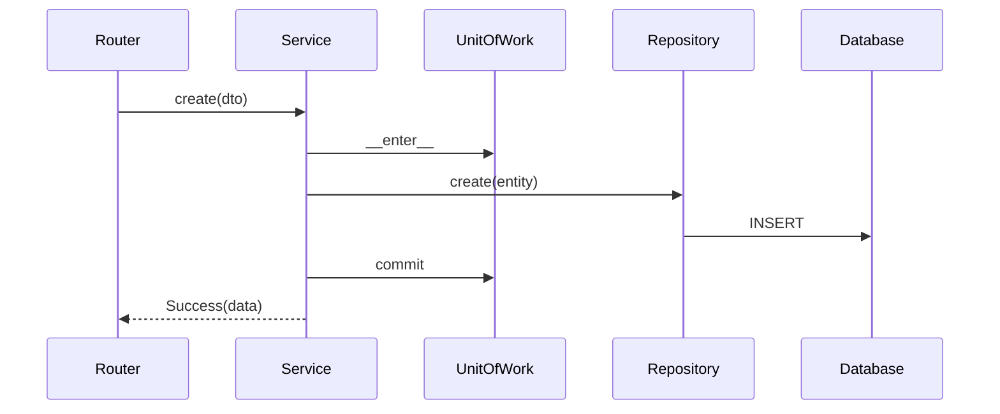

# Enterprise Application Patterns

**Data:** 2026-06-24

---

## Visão Geral

```
Router → Service → Repository → Database
  ↓        ↓          ↓
  DTO    UoW/Events  Model
  ↓        ↓
Response  Audit
```

---

## Repository Pattern

**Localização:** `repositories/base/base_repository.py`

**Uso:**
```python
class DoctorRepository(BaseRepository[Doctor]):
    def __init__(self, session: Session):
        super().__init__(Doctor, session)
```

**Responsabilidades:**
- CRUD genérico
- Acesso a dados isolado
- Abstração do SQLAlchemy

---

## Service Pattern

**Localização:** `services/base/base_service.py`

**Uso:**
```python
class DoctorService(BaseService[Doctor]):
    def __init__(self, uow: UnitOfWork):
        super().__init__(uow)
```

**Responsabilidades:**
- Lógica de negócio
- Transações via UoW
- Eventos e auditoria

---

## Mapper Pattern

**Localização:** `mappers/base_mapper.py`

**Uso:**
```python
class DoctorMapper(BaseMapper[Doctor, DoctorResponseDTO]):
    def __init__(self):
        super().__init__(Doctor, DoctorResponseDTO)
```

**Responsabilidades:**
- Model ↔ DTO
- Nunca expor SQLAlchemy nos Routers

---

## Query Objects

**Localização:** `common/query/`

**Uso:**
```python
query = PaginationQuery(page=1, size=20)
sorting = SortingQuery(field="name", direction="asc")
```

---

## Result Pattern

**Localização:** `common/result.py`

**Uso:**
```python
result = Success(data=doctor)
result = Failure(error="Not found", code="NOT_FOUND")
```

---

## Unit of Work

**Localização:** `database/unit_of_work.py`

**Uso:**
```python
with UnitOfWork() as uow:
    repo = DoctorRepository(uow.session)
    repo.create(doctor)
    # commit automático
```

---

## Event Dispatcher

**Localização:** `events/event_dispatcher.py`

**Uso:**
```python
dispatcher = EventDispatcher()
dispatcher.register("doctor.created", handler)
dispatcher.dispatch(Event(name="doctor.created", data={...}))
```

---

## API Response

**Localização:** `common/api_response.py`

**Formato:**
```json
{
    "success": true,
    "data": {},
    "meta": {},
    "errors": []
}
```

---

## Diagrama de Interação


