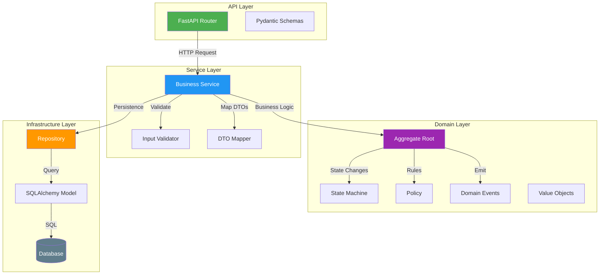
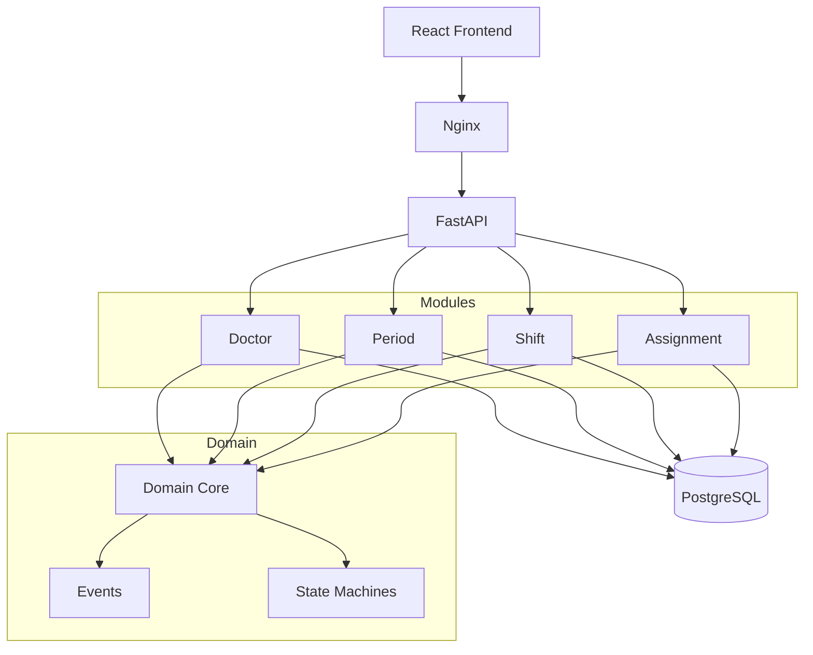
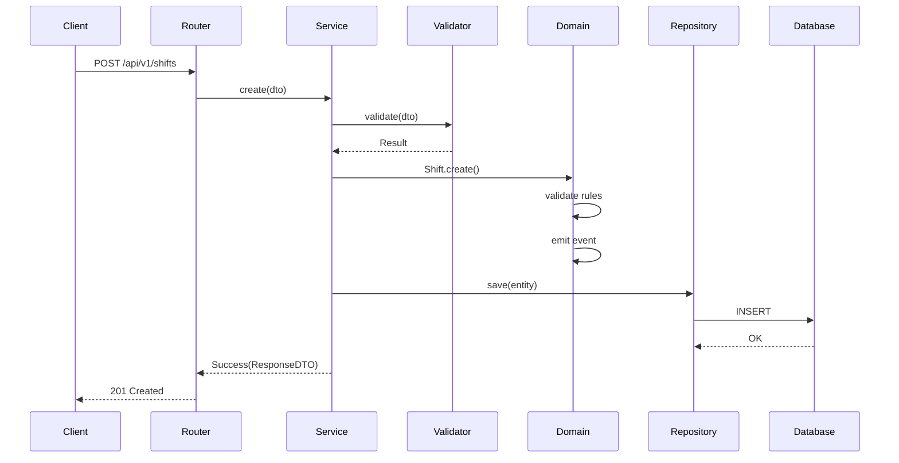
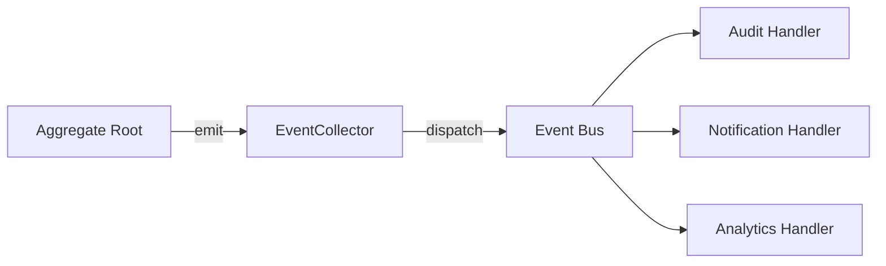

# Architecture Baseline V1 — Plantão 360

**Version:** 1.0
**Date:** 2026-06-26
**Status:** Frozen (Engineering Freeze)

---

## 1. Objectives

The Plantão 360 platform aims to:

- Manage medical shift scheduling for Unimed hospitals
- Provide a reliable, auditable, and scalable system
- Follow enterprise architecture patterns
- Support future integrations (Payroll, Tasy, Analytics)

---

## 2. Principles

| Principle | Description |
|-----------|-------------|
| Monolith Modular | Single deployable unit with clear module boundaries |
| Clean Architecture | Layers: API → Service → Domain → Infrastructure |
| Domain-Driven Design | Aggregates, Value Objects, Domain Events |
| Manifest-Driven Governance | Architecture defined by YAML manifests |
| Golden Module Pattern | All modules follow Doctor architecture |
| Engineering Freeze | Infrastructure frozen; changes require ADR |

---

## 3. Tech Stack

### Backend
- Python 3.12
- FastAPI (async)
- SQLAlchemy 2.0 (ORM)
- Alembic (migrations)
- Pydantic V2 (validation)
- PyYAML (manifests)

### Frontend
- React 18
- TypeScript 5
- Vite 5
- MUI 5 (Material UI)
- React Query 5

### Infrastructure
- Docker + Docker Compose
- Nginx (reverse proxy)
- SQLite (dev) / PostgreSQL (prod)

### Quality
- pytest (testing)
- Coverage ≥ 80%
- Architecture Validator
- Golden Guard
- Architecture Lint

---

## 4. Project Structure

```
plantao360/
├── backend/
│   ├── app/
│   │   ├── api/           # FastAPI routes
│   │   ├── common/        # Shared utilities
│   │   ├── domain/        # Domain layer
│   │   ├── mappers/       # DTO mappers
│   │   ├── models/        # SQLAlchemy models
│   │   ├── repositories/  # Data access
│   │   ├── schemas/       # DTOs (Pydantic)
│   │   ├── services/      # Business logic
│   │   ├── tests/         # Test suite
│   │   └── validators/    # Input validation
│   ├── architecture/      # Module manifests
│   │   └── manifests/     # YAML manifests
│   ├── architecture_rules/# Architecture rules
│   └── templates/         # Module generator templates
├── frontend/              # React application
├── tools/                 # Governance tools
├── docs/                  # Documentation
│   ├── adr/               # Architecture Decision Records
│   ├── architecture/      # Architecture docs
│   ├── domain/            # Domain docs
│   ├── modules/           # Module docs
│   └── reviews/           # Review reports
└── docker/                # Docker configuration
```

---

## 5. Layered Architecture



---

## 6. Domain Core

### 6.1 Base Classes

- `AggregateRoot` — Base for all aggregates (id, version, events, lifecycle hooks)
- `EventCollector` — Collects domain events during operations
- `BusinessCalendar` — Date calculations (business days)

### 6.2 State Machines

| Aggregate | States | Initial | Terminal |
|-----------|--------|---------|----------|
| Period | draft, closed, paid | draft | paid |
| Shift | scheduled, in_progress, completed, cancelled | scheduled | completed, cancelled |
| Assignment | planned, confirmed, started, completed, cancelled | planned | completed, cancelled |

### 6.3 Domain Events (22 total)

| Aggregate | Events |
|-----------|--------|
| Doctor | created, updated, deactivated |
| Period | created, closed, reopened, paid |
| Shift | created, updated, started, completed, cancelled |
| Assignment | created, updated, confirmed, started, completed, cancelled, removed |
| Extra | created, updated, approved, rejected |

### 6.4 Value Objects

- `ShiftTimeRange` — Start/end time with duration calculation
- `ShiftTimeline` — Timeline position within a shift
- `AssignmentTimeline` — Assignment time positioning
- `AssignmentDuration` — Duration calculation for payroll
- `DoctorReference` — Reference to doctor entity
- `ShiftReference` — Reference to shift entity

---

## 7. Module Manifest System

### 7.1 Purpose

Each aggregate has a YAML manifest declaring its complete architectural identity.

### 7.2 Manifest Structure

```yaml
manifest_version: 1
module_id: scheduling.assignment
module:
  canonical_name: Assignment
  storage_name: shift_part
  storage_table: shift_parts
ownership:
  aggregate: Shift
  bounded_context: Scheduling
stability:
  level: stable
  since: Sprint 5
  adr: ADR-015
lifecycle:
  states: [planned, confirmed, started, completed, cancelled]
  initial_state: planned
  terminal_states: [completed, cancelled]
capabilities:
  model: true
  repository: true
  service: true
  # ... more capabilities
validation_profile: enterprise
adr_references:
  - id: ADR-015
    title: Assignment Domain
```

### 7.3 Manifests

| Module | ID | Storage | Bounded Context |
|--------|----|---------|----|
| Doctor | medical.doctor | doctor | Medical |
| Period | scheduling.period | period | Scheduling |
| Shift | scheduling.shift | shift | Scheduling |
| Assignment | scheduling.assignment | shift_part | Scheduling |

---

## 8. Platform Governance

### 8.1 Tools

| Tool | Purpose |
|------|---------|
| `manifest_validator.py` | Validates manifest schema |
| `manifest_loader.py` | Resolves capabilities to paths |
| `validate_architecture.py` | Validates module capabilities |
| `golden_guard.py` | Compares against Golden Module |
| `lint_architecture.py` | Checks architectural violations |
| `architecture_score.py` | Calculates quality score |
| `compliance_report.py` | Generates compliance reports |
| `docs_generator.py` | Generates module documentation |
| `module_generator.py` | Scaffolds new modules |

### 8.2 Quality Gates

| Gate | Threshold | Current |
|------|-----------|---------|
| Architecture Validator | 100% | 100% |
| Architecture Lint | 0 violations | 0 |
| Architecture Score | ≥80 | 98.0 |
| Manifest Validator | 100% | 100% |

---

## 9. Development Process

### 9.1 New Module

1. Run `module_generator.py` to scaffold
2. Implement business logic
3. Create manifest
4. Run quality gates
5. Register in `app.py`

### 9.2 Structural Change

1. Write ADR
2. Get approval
3. Implement change
4. Update manifests
5. Update documentation
6. Run quality gates

---

## 10. Evolution Strategy

| Phase | Focus | Status |
|-------|-------|--------|
| Foundation | Infrastructure, patterns | COMPLETE |
| Golden Module | Doctor as reference | COMPLETE |
| IDP | Developer platform | COMPLETE |
| Governance | Quality gates | COMPLETE |
| Domain Core | Shared domain logic | COMPLETE |
| Module Manifests | Architecture contracts | COMPLETE |
| Engineering Freeze | Architecture stabilization | COMPLETE |
| **Domain Phase** | **Business rules** | **NEXT** |

---

## Diagrams

### Overview



### HTTP Flow



### Event Flow


