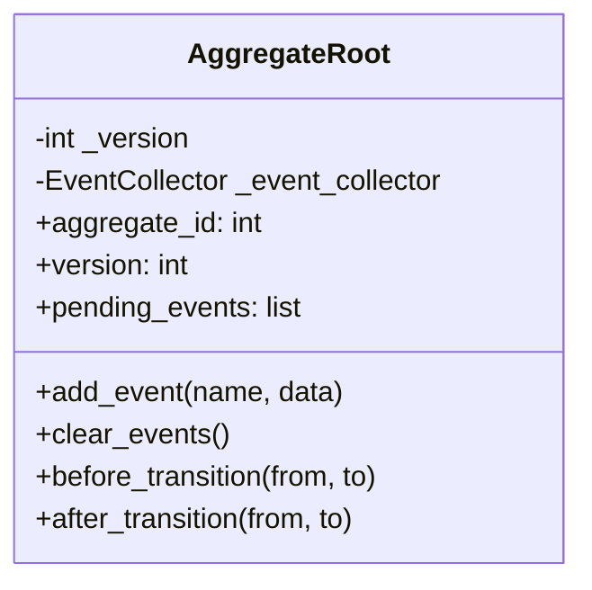
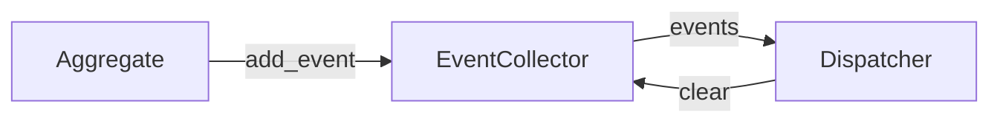
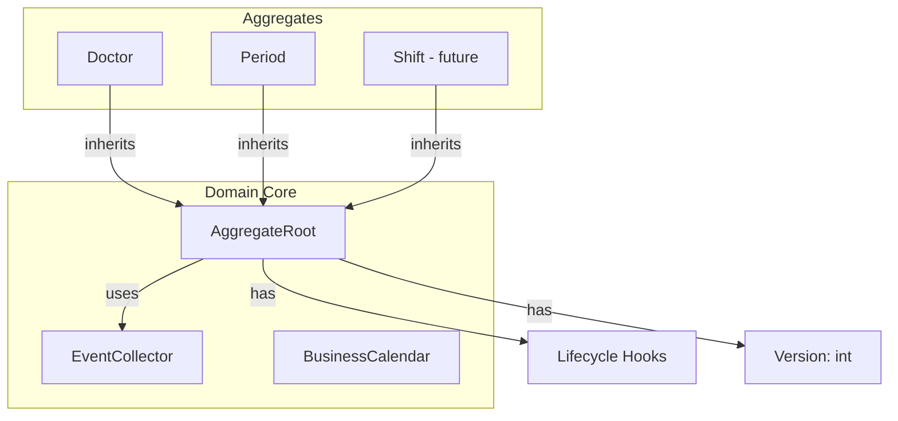

# Domain Core — Consolidated Foundation

## Overview

The Domain Core is the minimal shared foundation for all Aggregates in the Plantão 360 domain. It is frozen as of Sprint 3.1. Any future change requires ADR.

**Principle:** Extract only what already exists in at least two Aggregates.

---

## Components

### AggregateRoot



- `aggregate_id` — reads `id` attribute from the model
- `version` — starts at 1, prepared for future optimistic locking
- `pending_events` — events queued by the Aggregate
- `before_transition()` / `after_transition()` — empty hooks for future use

### EventCollector



- Single responsibility: manage pending events
- Aggregate registers events via `add_event()`
- Dispatcher reads and clears after dispatch
- Never fires events directly from the Aggregate

### BusinessCalendar

| Method | Description |
|--------|-------------|
| `current_business_day()` | Returns nearest business day (today or next) |
| `is_business_day(d)` | Returns `True` if Mon–Fri |
| `next_business_day(d)` | Next weekday after `d` |
| `previous_business_day(d)` | Previous weekday before `d` |
| `first_business_day(year, month)` | First weekday of month |
| `last_business_day(year, month)` | Last weekday of month |

**Design:** No holiday integration. Extension points prepared for future holidays.

### Lifecycle Hooks

```python
before_transition(from_status, to_status)  # default: no-op
after_transition(from_status, to_status)   # default: no-op
```

Empty hooks that Aggregates can override. No external calls, no events, no persistence.

---

## Directory Structure

```
app/domain/
├── base/
│   ├── __init__.py
│   └── aggregate_root.py      ← AggregateRoot
├── calendar/
│   ├── __init__.py
│   └── business_calendar.py   ← BusinessCalendar
├── events/
│   ├── __init__.py
│   ├── event_collector.py     ← EventCollector
│   └── event_names.py         ← DomainEventName
├── services/                  ← Domain services (empty for now)
│   └── __init__.py
├── policies/                  ← PeriodPolicy
├── state_machines/            ← PeriodStateMachine
├── transitions/               ← PeriodTransition
├── snapshots/                 ← PeriodSnapshot
├── contracts/                 ← PeriodContract
├── metrics/                   ← PeriodMetrics
├── constants/
├── errors/
├── exceptions/
├── rules/
└── value_objects/
```

---

## What Was NOT Extracted

| Abstraction | Reason |
|-------------|--------|
| BasePolicy | Only Period has Policy |
| BaseStateMachine | Only Period has State Machine |
| BaseRepository | Application layer, not domain |
| BaseEntity | SQLAlchemy already provides |
| DomainRegistry | Overengineering |
| Generic Factory | Overengineering |
| Service Locator | Anti-pattern |
| Event Bus | Too complex for current needs |
| CQRS | Not needed yet |
| Event Sourcing | Not needed yet |

---

## Diagram: Domain Core Architecture



---

## Impact for Shift Aggregate

The Shift Aggregate will:
- Inherit from `AggregateRoot`
- Use `EventCollector` for shift events
- Use `BusinessCalendar` for date calculations
- Implement `before_transition()` / `after_transition()` as needed
