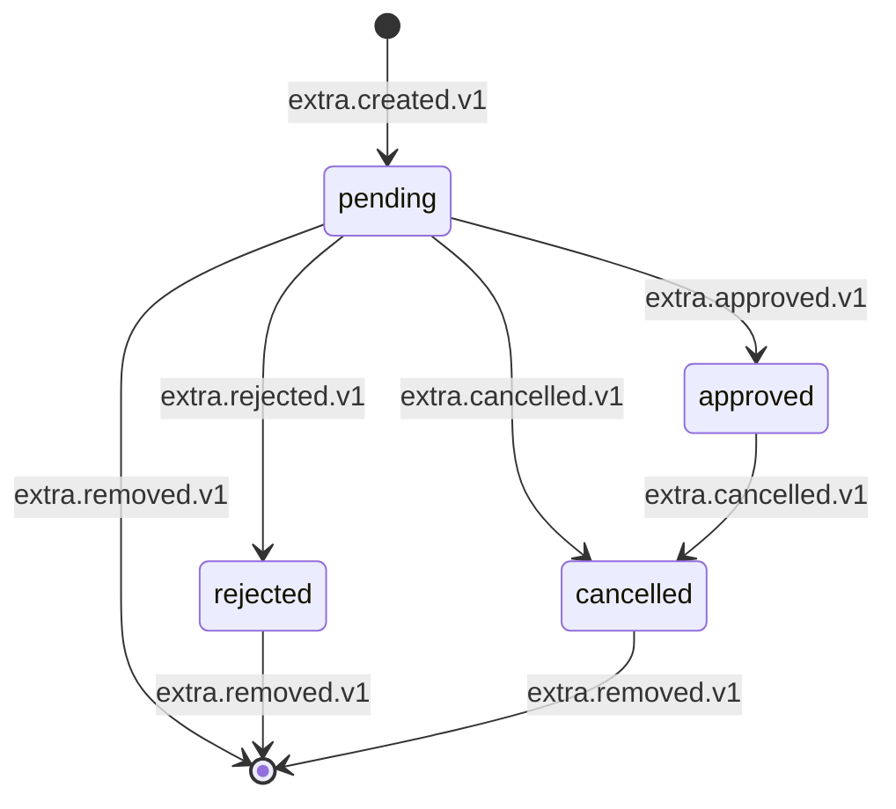

# Eventos de Domínio — Extras de Plantão

**Data:** 2026-06-26
**Sprint:** 6

---

## Eventos Definidos

| Evento | Trigger | Descrição |
|--------|---------|-----------|
| `extra.created.v1` | Criação do Extra | Novo Extra registrado no sistema |
| `extra.approved.v1` | Aprovação pela coordenação | Extra autorizado para pagamento |
| `extra.rejected.v1` | Rejeição pela coordenação | Extra negado |
| `extra.cancelled.v1` | Cancelamento | Extra cancelado pelo médico ou coordenação |
| `extra.removed.v1` | Remoção | Extra removido do sistema |

---

## Justificativa dos Eventos

### extra.created.v1

**Quando:** Médico ou coordenação registra um novo Extra.

**Por quê:** Permitir que outros componentes reajam à criação (notificação, validação, auditoria).

**Dados do evento:**
```json
{
  "event": "extra.created.v1",
  "aggregate_id": "extra_id",
  "shift_id": 123,
  "doctor_id": 456,
  "duration_minutes": 60,
  "justification": "Cobertura de emergência"
}
```

---

### extra.approved.v1

**Quando:** Coordenação autoriza o Extra.

**Por quê:** Extra aprovado gera obrigação financeira. Payroll precisa ser notificado.

**Dados do evento:**
```json
{
  "event": "extra.approved.v1",
  "aggregate_id": "extra_id",
  "approved_by": "coordination_id",
  "approved_at": "2026-06-26T10:00:00Z"
}
```

---

### extra.rejected.v1

**Quando:** Coordenação rejeita o Extra.

**Por quê:** Extra rejeitado não gera obrigação financeira. Médico deve ser notificado.

**Dados do evento:**
```json
{
  "event": "extra.rejected.v1",
  "aggregate_id": "extra_id",
  "rejected_by": "coordination_id",
  "reason": "Duração não compatível com registro de ponto"
}
```

---

### extra.cancelled.v1

**Quando:** Médico ou coordenação cancela o Extra.

**Por quê:** Cancelamento remove o Extra da consideração de pagamento.

**Dados do evento:**
```json
{
  "event": "extra.cancelled.v1",
  "aggregate_id": "extra_id",
  "cancelled_by": "user_id",
  "reason": "Registro duplicado"
}
```

---

### extra.removed.v1

**Quando:** Extra é removido permanentemente do sistema.

**Por quê:** Remoção é diferente de cancelamento — o registro deixa de existir.

**Dados do evento:**
```json
{
  "event": "extra.removed.v1",
  "aggregate_id": "extra_id",
  "removed_by": "user_id",
  "reason": "Extra fantasma identificado"
}
```

---

## Fluxo de Eventos



---

## Integração com Eventos Existentes

| Evento existente | Relação com Extra |
|------------------|-------------------|
| shift.completed.v1 | Pode triggerar alerta para registrar Extras |
| period.closed.v1 | Bloqueia novos Extras |
| period.paid.v1 | Confirma pagamento de Extras |
