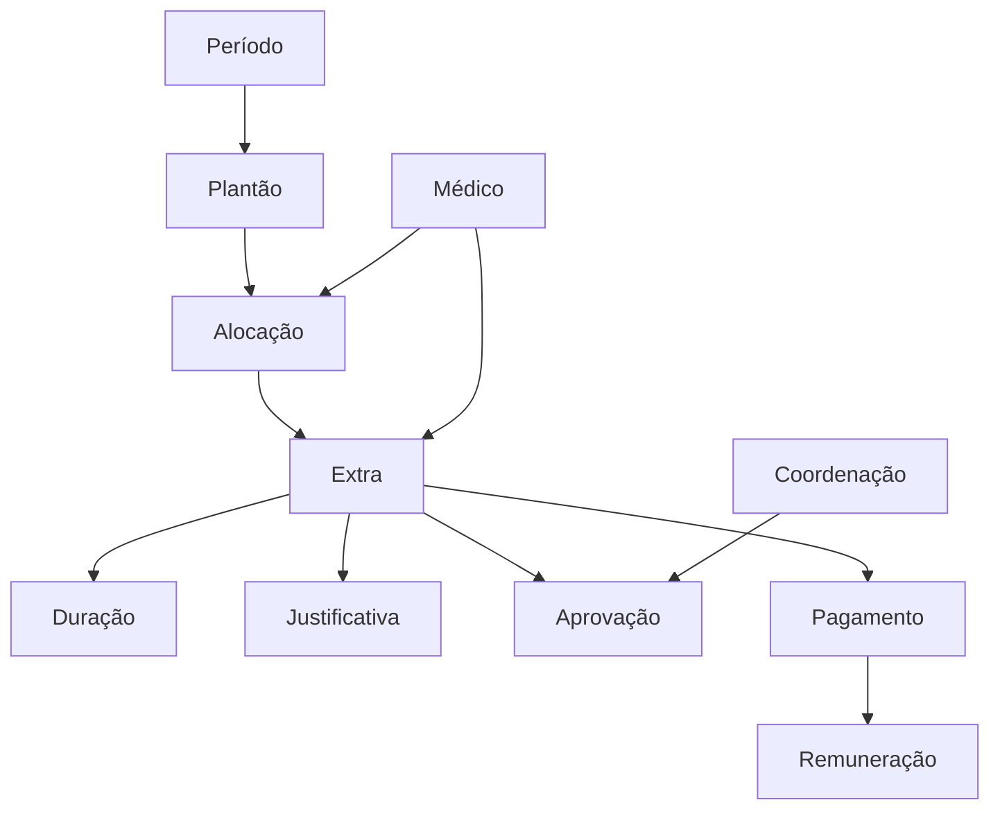

# Glossário — Extras de Plantão

**Data:** 2026-06-26
**Sprint:** 6

---

## Termos do Domínio

| Termo | Definição |
|-------|-----------|
| **Extra de Plantão** | Registro de trabalho adicional, fora do horário previsto na Alocação, que ocorre durante a execução de um Plantão |
| **Hora Extra** | Período de uma hora de trabalho adicional. Unidade de medição para cálculo de pagamento |
| **Complemento** | Tempo adicional que complementa a jornada prevista |
| **Acréscimo** | Valor financeiro adicionado à remuneração em decorrência de Extra |
| **Justificativa** | Documento ou registro que descreve o motivo do Extra. Obrigatório para todos os Extras |
| **Aprovação** | Decisão formal da Coordenação aceitando ou rejeitando um Extra |
| **Pagamento** | Processo de transferência de valor ao Médico referente a Extras aprovados |
| **Fechamento** | Processo de conclusão de um Período, congelando dados para pagamento |
| **Competência** | Período de referência (mês/ano) ao qual o Extra pertence |
| **Médico** | Profissional de saúde registrado no sistema, com CRM, nome e valor hora |
| **Coordenação** | Equipe responsável pela gestão operacional dos Plantões e autorização de Extras |
| **Plantão** | Período de trabalho predefinido (T1, T2, T3, R1, R2) em uma data específica |
| **Alocação** | Vinculação de um Médico a um Plantão com horário específico de início e fim |
| **Período** | Container mensal (mês/ano) que agrupa todos os Plantões |
| **Duração** | Tempo em minutos que um Extra durou |
| **Valor Hora** | Montante financeiro pago por hora trabalhada por um Médico |
| **Multiplicador** | Fator que aumenta o valor do Extra conforme regras (noturno, feriado, etc.) |
| **Passivo Financeiro** | Obrigação financeira acumulada de Extras não pagos |
| **Remuneração** | Total de valores pagos a um Médico em um Período |

---

## Relações entre Termos

