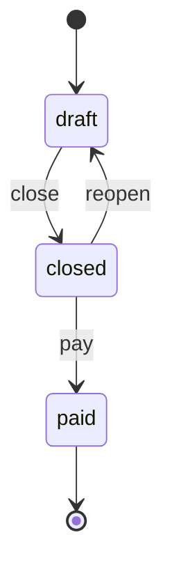
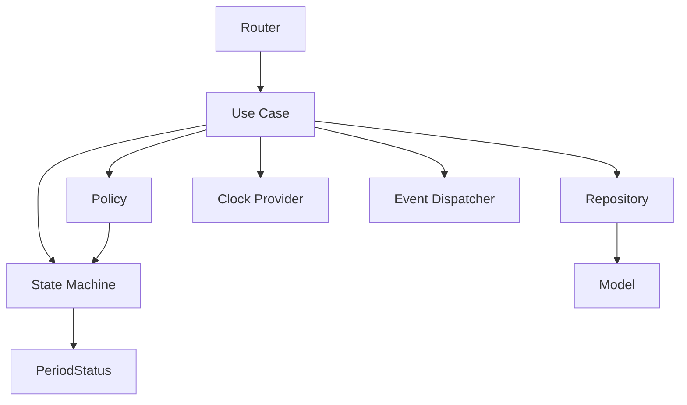

# Period Aggregate — Lifecycle & Domain Architecture

## Overview

The Period module is the first **Aggregate Root** in the Plantão 360 domain. It manages the lifecycle of a billing period (year/month) and serves as the reference implementation for all future Aggregates (Shift, ShiftPart, ShiftExtra, Payroll).

---

## Aggregate Root

The Period model is the Aggregate Root. All state changes flow through the Use Cases, which delegate to the State Machine and Policy.

**Responsibilities:**
- Hold identity (id, year, month)
- Maintain lifecycle status (draft → closed → paid)
- Enforce invariants
- Emit domain events

**NOT responsibilities:**
- Managing shifts (delegated to Shift Aggregate)
- Calculating payments (delegated to Payroll Aggregate)
- Persisting itself (delegated to Repository)

---

## State Machine



### Transitions

| Current | Target | Allowed | Use Case | Event |
|---------|--------|---------|----------|-------|
| draft | closed | Yes | ClosePeriod | period.closed.v1 |
| closed | draft | Yes | ReopenPeriod | period.reopened.v1 |
| closed | paid | Yes | (future) | period.paid.v1 |
| draft | paid | **No** | — | — |
| paid | closed | **No** | — | — |
| paid | draft | **No** | — | — |

### Implementation

- `PeriodStateMachine` — validates transitions, returns specific error codes
- `PeriodPolicy` — queries allowed operations without changing state

---

## Domain Events

| Event | Trigger | Data |
|-------|---------|------|
| `period.created.v1` | CreatePeriod | id, year, month |
| `period.updated.v1` | UpdatePeriod | id, year, month |
| `period.closed.v1` | ClosePeriod | id, year, month |
| `period.reopened.v1` | ReopenPeriod | id, year, month |

All events follow `.v1` versioning (ADR-010).

---

## Invariants

1. **Uniqueness:** Only one Period per (year, month) pair
2. **Year range:** 2000–2100
3. **Month range:** 1–12
4. **Immutability:** Paid periods cannot be modified or reopened
5. **Status transitions:** Enforced by State Machine only

---

## Policies

The `PeriodPolicy` provides query methods:
- `can_close(status)` → can this status transition to closed?
- `can_reopen(status)` → can this status transition to draft?
- `can_edit(status)` → is this status mutable?
- `can_pay(status)` → can this status transition to paid?
- `allowed_transitions(status)` → set of reachable states

---

## Snapshots

Read-only representations for export, audit, reports, and debugging.

```python
PeriodSnapshot(
    id=1, year=2026, month=6, status="closed",
    created_at=..., updated_at=...,
    number_of_shifts=10,
    number_of_doctors=5,
    total_hours=240.0,
)
```

---

## Transitions

Domain objects representing state changes (not persisted):

```python
PeriodTransition(
    period_id=1,
    previous_status="draft",
    new_status="closed",
    user="admin",
    timestamp=datetime.now(timezone.utc),
    reason="Month ended",
    event_name="period.closed.v1",
)
```

---

## Contract for External Aggregates

```python
PeriodContract(
    period_id=1, year=2026, month=6, status="draft",
)
```

| Operation | Permission |
|-----------|-----------|
| Query | Yes |
| Validate | Yes |
| Close | No |
| Change status | No |
| Reopen | No |
| Modify dates | No |

---

## Use Cases

| Use Case | Input | Output | Event |
|----------|-------|--------|-------|
| CreatePeriod | PeriodCreateDTO | PeriodResponseDTO | period.created.v1 |
| UpdatePeriod | id, PeriodUpdateDTO | PeriodResponseDTO | period.updated.v1 |
| ClosePeriod | id | PeriodResponseDTO | period.closed.v1 |
| ReopenPeriod | id | PeriodResponseDTO | period.reopened.v1 |
| GetPeriod | id | PeriodResponseDTO | — |
| ListPeriods | PeriodFilterDTO | Page[PeriodResponseDTO] | — |

---

## ClockProvider

All Use Cases depend on `ClockProvider` for time. Never use `datetime.now()` directly.

- `SystemClock` — production (UTC)
- `FutureClock` — testing (fixed time)

---

## Architecture Diagram


