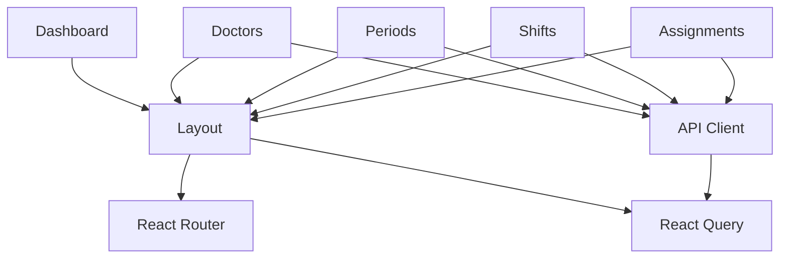

# Frontend Roadmap — Plantão 360

**Date:** 2026-06-26
**Sprint:** 5.2
**Status:** PLANNING (No implementation)

---

## Overview

This document outlines the frontend architecture plan for Plantão 360.

**Note:** No frontend implementation is planned until Sprint 6+. This is a planning document only.

---

## Tech Stack

| Technology | Version | Purpose |
|------------|---------|---------|
| React | 18 | UI framework |
| TypeScript | 5 | Type safety |
| Vite | 5 | Build tool |
| MUI | 5 | Component library |
| React Query | 5 | Server state management |
| React Router | 6 | Client-side routing |

---

## Module Structure

### Core Modules

| Module | Pages | Routes | Priority |
|--------|-------|--------|----------|
| Dashboard | 1 | / | HIGH |
| Doctors | 4 | /doctors/* | HIGH |
| Periods | 4 | /periods/* | HIGH |
| Shifts | 4 | /shifts/* | HIGH |
| Assignments | 4 | /assignments/* | HIGH |

### Future Modules

| Module | Pages | Routes | Priority |
|--------|-------|--------|----------|
| Extras | 3 | /extras/* | MEDIUM |
| Coverage | 2 | /coverage/* | MEDIUM |
| Payroll | 3 | /payroll/* | HIGH |
| Reports | 2 | /reports/* | LOW |
| Settings | 1 | /settings/* | LOW |

---

## Page Structure

### Dashboard

| Page | Route | Description |
|------|-------|-------------|
| Home | / | Overview, alerts, metrics |

### Doctors

| Page | Route | Description |
|------|-------|-------------|
| List | /doctors | Doctor list with filters |
| Detail | /doctors/:id | Doctor details |
| Create | /doctors/new | Create doctor |
| Edit | /doctors/:id/edit | Edit doctor |

### Periods

| Page | Route | Description |
|------|-------|-------------|
| List | /periods | Period list |
| Detail | /periods/:id | Period details |
| Create | /periods/new | Create period |
| Edit | /periods/:id/edit | Edit period |

### Shifts

| Page | Route | Description |
|------|-------|-------------|
| Calendar | /shifts | Shift calendar view |
| Detail | /shifts/:id | Shift details |
| Create | /shifts/new | Create shift |
| Edit | /shifts/:id/edit | Edit shift |

### Assignments

| Page | Route | Description |
|------|-------|-------------|
| List | /assignments | Assignment list |
| Detail | /assignments/:id | Assignment details |
| Create | /assignments/new | Assign doctor |
| Edit | /assignments/:id/edit | Edit assignment |

---

## Components

### Shared Components

| Component | Description |
|-----------|-------------|
| Layout | App shell, navigation |
| DataTable | Reusable table with sorting/filtering |
| Form | Form components with validation |
| Modal | Dialog components |
| Alert | Notification system |
| Loading | Loading states |
| Error | Error handling |

### Module-Specific Components

| Component | Module | Description |
|-----------|--------|-------------|
| DoctorCard | Doctors | Doctor info card |
| PeriodBadge | Periods | Period status badge |
| ShiftCalendar | Shifts | Calendar view |
| AssignmentForm | Assignments | Assignment creation |

---

## Permissions

| Role | Can Access |
|------|------------|
| Admin | All modules |
| Manager | Doctors, Periods, Shifts, Assignments |
| Doctor | Own profile, Own assignments |
| Viewer | Read-only access |

---

## API Integration

| Endpoint | Method | Page |
|----------|--------|------|
| /api/v1/doctors | GET | Doctor List |
| /api/v1/doctors/:id | GET | Doctor Detail |
| /api/v1/periods | GET | Period List |
| /api/v1/periods/:id | GET | Period Detail |
| /api/v1/shifts | GET | Shift Calendar |
| /api/v1/shifts/:id | GET | Shift Detail |
| /api/v1/assignments | GET | Assignment List |
| /api/v1/assignments/:id | GET | Assignment Detail |

---

## Dependencies

---

## Implementation Order

1. **Sprint 6:** Layout, Dashboard, API client
2. **Sprint 7:** Doctors module
3. **Sprint 8:** Periods module
4. **Sprint 9:** Shifts module
5. **Sprint 10:** Assignments module
6. **Sprint 11:** Extras, Coverage
7. **Sprint 12:** Payroll, Reports
