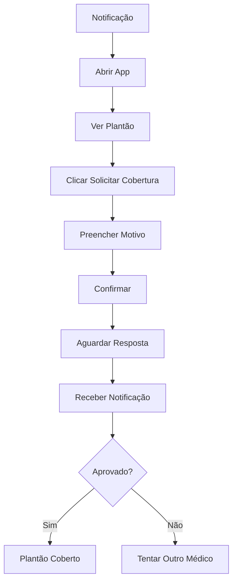

# Estratégia Mobile — Plantão 360

**Sprint:** 11 — Product Design, User Experience Modeling & Frontend Functional Specification
**Data:** 2026-06-27

---

## Visão Geral

Definição de quais funcionalidades funcionam no celular, quais exigem desktop e quais jornadas devem ser mobile first.

---

## 1. Funcionalidades Mobile

### O que FUNCIONA no celular

| Funcionalidade | Persona | Prioridade |
|---|---|---|
| Consultar agenda de plantões | Médico | Crítica |
| Solicitar cobertura | Médico | Crítica |
| Visualizar próximos plantões | Médico | Alta |
| Consultar remuneração | Médico | Alta |
| Registrar extra | Médico | Alta |
| Dashboard com KPIs | Coordenador, Diretor | Média |
| Aprovar/rejeitar cobertura | Coordenador | Média |
| Notificações | Todas | Alta |
| Busca rápida | Todas | Média |

### O que NÃO funciona no celular

| Funcionalidade | Persona | Motivo |
|---|---|---|
| Montar escala mensal | Coordenador | Complexidade de arrasto |
| Gerenciar múltiplas atribuições | Coordenador | Volume de dados |
| Configurar sistema | Administrador | Complexidade técnica |
| Gerar relatórios complexos | Financeiro, Auditor | Necessidade de tela grande |
| Editar múltiplos registros | RH, Coordenador | Volume de dados |

---

## 2. Jornadas Mobile First

### Jornada do Médico Plantonista

**Contexto:** Médico usando celular entre consultas ou em deslocamento.

#### Fluxo Mobile

```
1. Receber notificação de plantão próximo
2. Abrir app
3. Visualizar agenda do dia
4. Se necessário: solicitar cobertura
5. Confirmar presença
6. Fechar app
```

#### Telas Mobile

| Tela | Layout | Funcionalidades |
|---|---|---|
| Home | Card de próximo plantão | Visualizar, Notificações |
| Agenda | Lista cronológica | Filtrar por data |
| Plantão | Detalhes do plantão | Confirmar, Solicitar cobertura |
| Cobertura | Formulário simplificado | Preencher motivo, Enviar |
| Perfil | Dados pessoais | Visualizar, Editar básico |

#### Fluxo de Solicitação de Cobertura (Mobile)



---

## 3. Jornadas Desktop

### Jornada do Coordenador — Montar Escala

**Contexto:** Coordenador usando desktop para trabalho complexo.

#### Fluxo Desktop

```
1. Acessar módulo de Períodos
2. Selecionar período
3. Abrir calendário
4. Arrastar médicos para plantões
5. Resolver conflitos
6. Revisar escala
7. Fechar período
```

#### Por que Desktop?
- Arrastar e soltar requer tela grande
- Múltiplas colunas visíveis simultaneamente
- Comparação de dados complexa
- Operação de longa duração

---

## 4. Responsividade

### Breakpoints

| Dispositivo | Largura | Comportamento |
|---|---|---|
| Mobile | < 768px | Layout empilhado, menu hamburger |
| Tablet | 768px - 1024px | Layout adaptado, menu lateral colapsado |
| Desktop | > 1024px | Layout completo, menu lateral expandido |

### Adaptações por Tela

| Tela | Mobile | Tablet | Desktop |
|---|---|---|---|
| Dashboard | Cards empilhados | Grid 2 colunas | Grid 4 colunas |
| Tabelas | Cards | Tabela compacta | Tabela completa |
| Formulários | Fullscreen | Modal | Modal |
| Calendário | Lista | Grade compacta | Grade completa |
| Gráficos | Empilhados | Side by side | Grid completo |

---

## 5. Offline

### Funcionalidades Offline

| Funcionalidade | Disponível? | Cache |
|---|---|---|
| Visualizar agenda | ✅ | Sim (últimos dados) |
| Visualizar dados do médico | ✅ | Sim (dados pessoais) |
| Solicitar cobertura | ❌ | Requer conexão |
| Aprovar cobertura | ❌ | Requer conexão |
| Consultar KPIs | ❌ | Requer conexão |

### Estratégia de Cache

| Dado | Tempo de Cache | Atualização |
|---|---|---|
| Agenda do médico | 24 horas | Ao conectar |
| Dados pessoais | 1 hora | Ao conectar |
| Notificações | 5 minutos | Push |
| KPIs | Não cache | Sempre online |

---

## 6. Push Notifications

### Tipos de Notificação

| Tipo | Persona | Ação |
|---|---|---|
| Plantão próximo (24h) | Médico | Lembrete |
| Cobertura aprovada | Médico | Confirmação |
| Cobertura rejeitada | Médico | Informação |
| Nova atribuição | Médico | Informação |
| Cobertura pendente | Coordenador | Ação necessária |
| Payroll aprovado | Financeiro | Informação |

### Comportamento

| Evento | Ação |
|---|---|
| Toque na notificação | Abrir tela relevante |
| Notificação lida | Marcar como lida |
| Notificação expirada | Remover após 7 dias |

---

## 7. Gestos Mobile

| Gesto | Ação |
|---|---|
| Toque | Selecionar |
| Toque longo | Menu de contexto |
| Deslizar para baixo | Atualizar |
| Deslizar para a esquerda | Ação rápida (ex: cancelar) |
| Pinçar | Zoom em gráficos |

---

## Resumo da Estratégia

| Aspecto | Decisão |
|---|---|
| Mobile First | Jornadas do Médico |
| Desktop | Jornadas do Coordenador, Financeiro |
| Responsivo | Todas as telas |
| Offline | Apenas visualização |
| Push | Notificações críticas |
| Gestos | Intuitivos e padrão |

---

## Validação

| Critério | Status |
|---|---|
| Funcionalidades mobile listadas | ✅ |
| Jornadas mobile first definidas | ✅ |
| Jornadas desktop definidas | ✅ |
| Breakpoints documentados | ✅ |
| Estratégia offline definida | ✅ |
| Push notifications documentadas | ✅ |
| Gestos definidos | ✅ |
