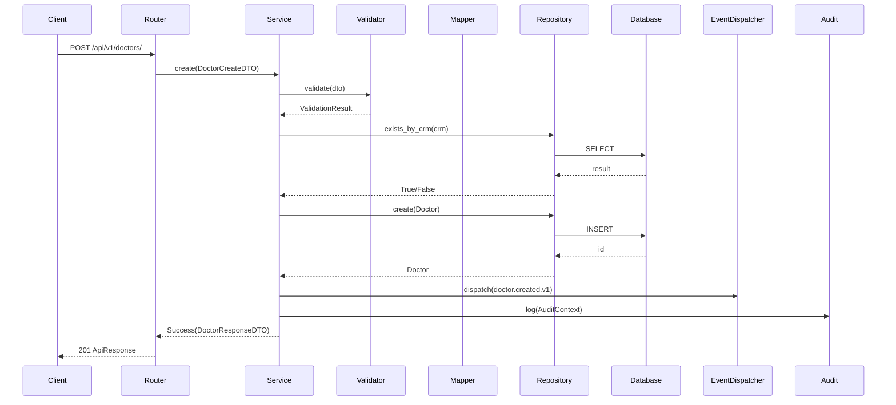

# Golden Module — Doctors

**Data:** 2026-06-25

---

## Visão Geral

O módulo Doctors é o **Golden Module** do Plantão 360. Todos os módulos futuros devem seguir exatamente esta arquitetura.

---

## Fluxo Completo



---

## Estrutura de Arquivos

```
app/
├── repositories/
│   ├── interfaces/
│   │   └── doctor_repository.py    # Protocol (interface)
│   ├── base/
│   │   └── base_repository.py      # Base genérica
│   ├── doctor_repository.py        # Implementação
│   └── specifications/
│       └── doctor_specifications.py # Specification patterns
├── services/
│   └── doctor_service.py           # Lógica de negócio
├── mappers/
│   ├── base_mapper.py              # Base genérica
│   └── doctor_mapper.py            # Doctor Mapper
├── schemas/
│   └── doctor/
│       ├── doctor_create.py        # CreateDTO
│       ├── doctor_update.py        # UpdateDTO
│       ├── doctor_response.py      # ResponseDTO
│       ├── doctor_summary.py       # SummaryDTO (list)
│       ├── doctor_detail.py        # DetailDTO (detail)
│       ├── doctor_filters.py       # FilterDTO
│       └── doctor_query.py         # QueryDTO
├── validators/
│   ├── base_validator.py           # Base
│   ├── doctor_validator.py         # Orquestrador
│   └── rules/
│       ├── crm.py                  # Regra CRM
│       ├── hour_rate.py            # Regra valor hora
│       └── doctor_name.py          # Regra nome
├── audit/
│   ├── context.py                  # AuditContext
│   └── service.py                  # AuditService
├── domain/
│   ├── errors/
│   │   └── doctor_errors.py        # DoctorErrorCode
│   └── events/
│       └── event_names.py          # DomainEventName (v1)
├── api/
│   └── routes/
│       └── doctors.py              # Router
└── tests/
    ├── unit/
    │   ├── test_doctor_model.py
    │   ├── test_doctor_repository.py
    │   ├── test_doctor_service.py
    │   ├── test_doctor_mapper.py
    │   └── test_doctor_validator.py
    ├── integration/
    │   └── test_doctors_api.py
    └── contracts/
        └── test_doctor_contracts.py
```

---

## DTOs

| DTO | Uso | Exemplo |
|-----|-----|---------|
| `DoctorCreateDTO` | `POST /doctors/` | `{"name": "Dr. João", "crm": "12345", "hour_rate": 150}` |
| `DoctorUpdateDTO` | `PUT /doctors/{id}` | `{"name": "Dr. João Updated"}` |
| `DoctorResponseDTO` | Resposta padrão | `{id, name, crm, hour_rate, active}` |
| `DoctorSummaryDTO` | Listagem | `{id, name, crm, active}` |
| `DoctorDetailDTO` | Detalhes | `{id, name, crm, hour_rate, active, total_shifts, total_extras}` |
| `DoctorFilterDTO` | Query params | `{page, size, name, crm, active, sort_by, sort_direction}` |
| `DoctorQueryDTO` | Query Object | `{search, name, crm, active, page, size, sort_by, sort_direction}` |

---

## Response Format

### Sucesso

```json
{
    "success": true,
    "data": { "id": 1, "name": "Dr. João", "crm": "12345", "hour_rate": 150.0, "active": true },
    "meta": {},
    "errors": []
}
```

### Erro com código

```json
{
    "success": false,
    "error": {
        "code": "DOCTOR_ALREADY_EXISTS",
        "message": "CRM 12345 já cadastrado",
        "details": null
    }
}
```

### Headers de paginação

```
X-Total-Count: 25
X-Page: 1
X-Page-Size: 20
X-Total-Pages: 2
```

---

## Error Codes

| Code | Descrição |
|------|-----------|
| `DOCTOR_ALREADY_EXISTS` | CRM já cadastrado |
| `DOCTOR_NOT_FOUND` | Médico não encontrado |
| `DOCTOR_INACTIVE` | Médico inativo |
| `INVALID_CRM` | Formato de CRM inválido |
| `INVALID_HOUR_RATE` | Valor hora inválido |
| `INVALID_NAME` | Nome inválido |

---

## Event Versioning

| Evento | Descrição |
|--------|-----------|
| `doctor.created.v1` | Médico criado |
| `doctor.updated.v1` | Médico atualizado |
| `doctor.deactivated.v1` | Médico desativado |

---

## Testes

| Camada | Arquivo | Testes |
|--------|---------|--------|
| Unit (model) | test_doctor_model.py | 1 |
| Unit (repository) | test_doctor_repository.py | 11 |
| Unit (service) | test_doctor_service.py | 10 |
| Unit (mapper) | test_doctor_mapper.py | 3 |
| Unit (validator) | test_doctor_validator.py | 6 |
| Integration | test_doctors_api.py | 8 |
| Contracts | test_doctor_contracts.py | 14 |
| **Total** | | **53** |
