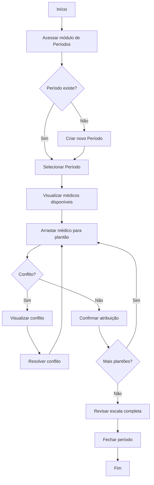
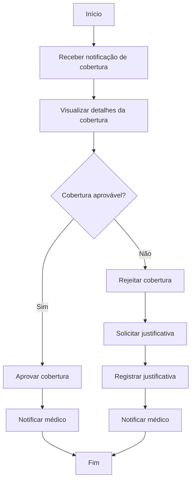
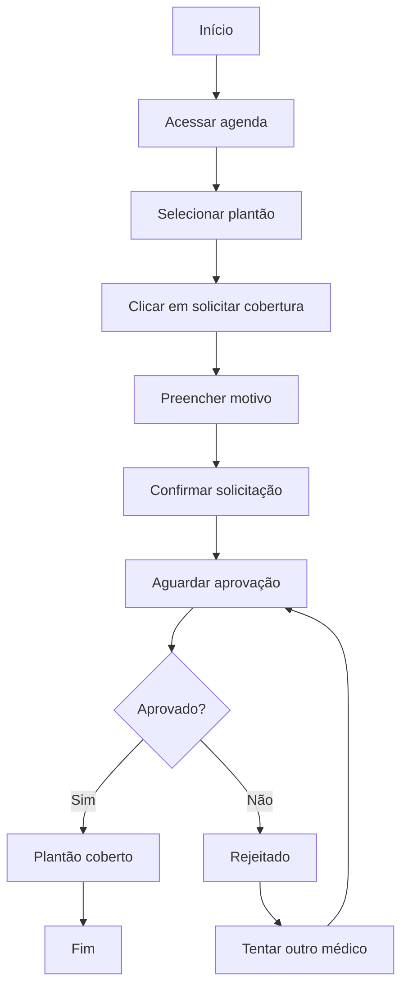
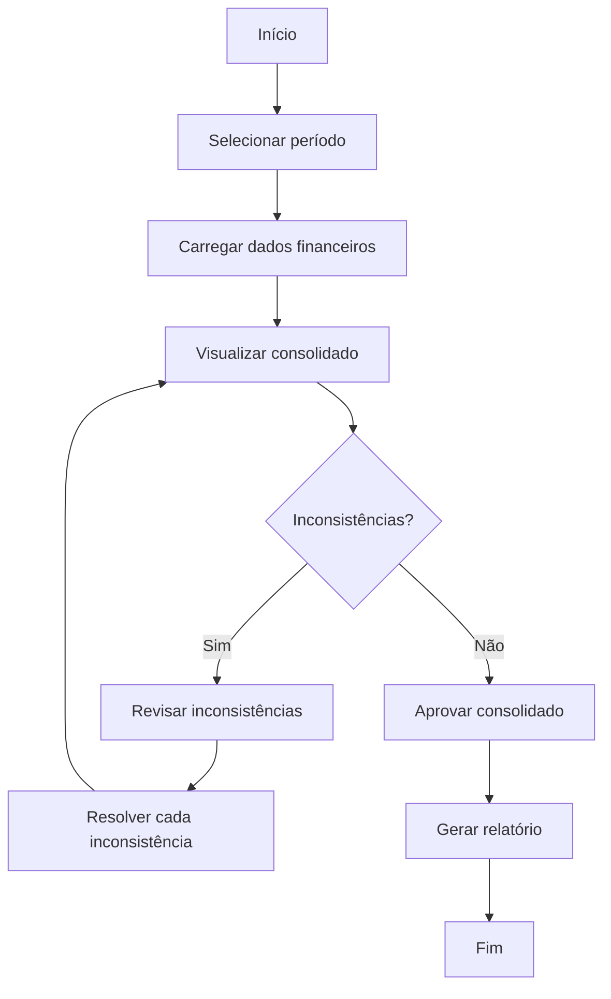
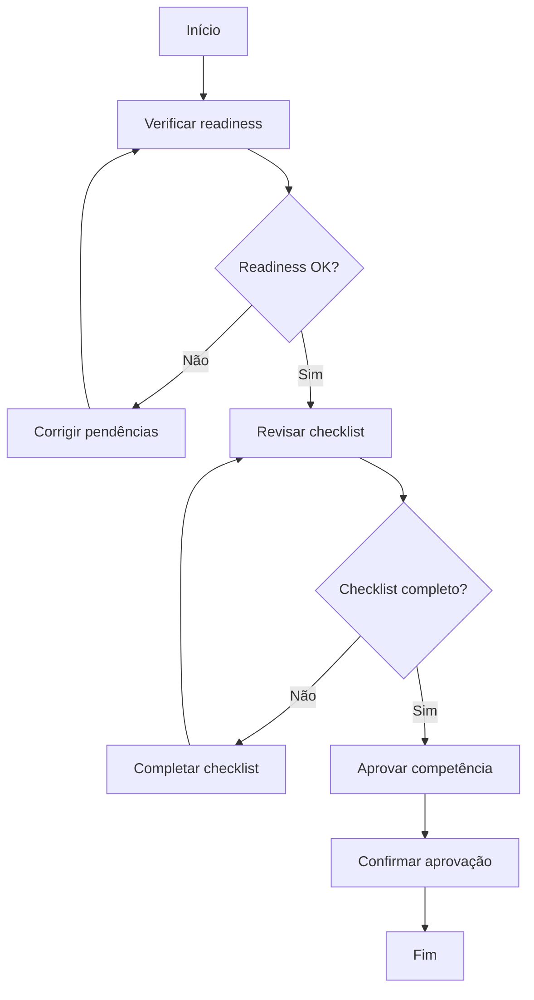
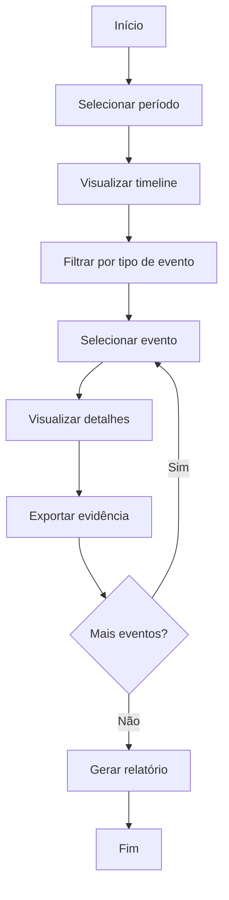
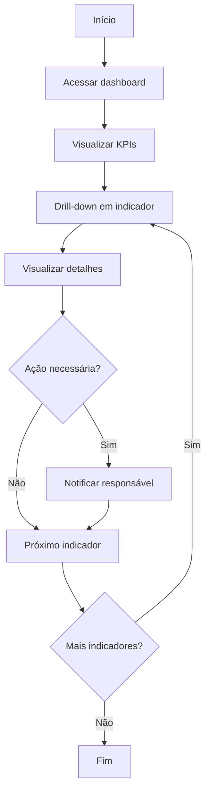

# User Journeys Detalhadas — Plantão 360

**Sprint:** 11 — Product Design, User Experience Modeling & Frontend Functional Specification
**Data:** 2026-06-27

---

## 1. Coordenador Médico — Montar Escala Mensal

### Fluxo BPMN

### Início
- Coordenador recebe demanda de escala do mês seguinte
- Acessa o sistema via desktop

### Objetivo
- Montar escala completa de plantões do mês

### Decisões
1. Qual médico atribuir a cada plantão?
2. Como resolver conflitos de agenda?
3. Como distribuir cargas de trabalho igualmente?

### Exceções
- Médico não disponível: buscar alternativa
- Conflito de agenda: realocar plantão
- Cobertura pendente: aguardar ou atribuir outro

### Erros
- Médico já atribuído: sistema avisa e sugere alternativa
- Período fechado: não permite edição
- Dados incompletos: solicita preenchimento

### Dependências
- Lista de médicos ativos
- Período criado e aberto
- Regras de cobertura configuradas

### Finalização
- Escala revisada e completa
- Período fechado
- Médicos notificados

---

## 2. Coordenador Médico — Resolver Conflito de Cobertura

### Fluxo BPMN

### Início
- Coordenador recebe notificação de solicitação de cobertura

### Objetivo
- Resolver cobertura rapidamente

### Decisões
1. Aprovar ou rejeitar cobertura?
2. Qual médico substituto?
3. Impacto na escala?

### Exceções
- Sem médico substituto: buscar alternativa
- Cobertura urgente: priorizar resolução
- Múltiplas coberturas: priorizar por urgência

### Erros
- Cobertura já resolvida: informar status atual
- Médico indisponível: sugerir alternativa

### Dependências
- Lista de médicos disponíveis
- Regras de cobertura
- Políticas de aprovação

### Finalização
- Cobertura resolvida
- Médicos notificados
- Escala atualizada

---

## 3. Médico Plantonista — Solicitar Cobertura

### Fluxo BPMN

### Início
- Médico identifica necessidade de cobertura

### Objetivo
- Cobrir plantão que não poderá comparecer

### Decisões
1. Qual motivo da cobertura?
2. Há médico disponível?

### Exceções
- Sem médico disponível: manter plantão original
- Cobertura urgente: priorizar notificações

### Erros
- Motivo não preenchido: solicitar preenchimento
- Plantão já coberto: informar status

### Dependências
- Plantão ativo
- Lista de médicos disponíveis
- Sistema de notificações

### Finalização
- Solicitação enviada
- Aguardando resposta
- Notificação de resultado

---

## 4. Financeiro — Consolidar Dados Financeiros

### Fluxo BPMN

### Início
- Financeiro inicia processo de fechamento

### Objetivo
- Consolidar todos os dados financeiros do período

### Decisões
1. Dados estão corretos?
2. Há inconsistências para resolver?
3. Aprovar para processamento?

### Exceções
- Dados incompletos: aguardar conclusão
- Inconsistência crítica: pausar processo
- Prazo próximo: priorizar correções

### Erros
- Cálculo incorreto: recalcular
- Dados faltantes: solicitar

### Dependências
- Período fechado
- Todas as atribuições concluídas
- Todos os extras processados

### Finalização
- Dados consolidados
- Relatório gerado
- Aprovação registrada

---

## 5. Financeiro — Aprovar Processamento de Folha

### Fluxo BPMN

### Início
- Financeiro recebe notificação de prontidão

### Objetivo
- Aprovar processamento de folha

### Decisões
1. Readiness está OK?
2. Checklist está completo?
3. Aprovar ou rejeitar?

### Exceções
- Readiness não OK: corrigir pendências
- Checklist incompleto: completar itens
- Dados inconsistentes: pausar aprovação

### Erros
- Aprovação não permitida: verificar status
- Checklist inválido: revisar itens

### Dependências
- Competência em status CALCULATED ou REVIEWED
- Readiness validado
- Checklist completo

### Finalização
- Competência aprovada
- Próxima etapa: processamento

---

## 6. Auditor — Rastrear Decisões

### Fluxo BPMN

### Início
- Auditor inicia processo de auditoria

### Objetivo
- Rastrear todas as decisões e mudanças

### Decisões
1. Quais eventos auditar?
2. Quais evidências coletar?
3. Conformidade está adequada?

### Exceções
- Evento ausente: investigar
- Dados incompletos: solicitar
- Irregularidade: documentar

### Erros
- Período sem dados: verificar período
- Evento não encontrado: verificar filtros

### Dependências
- Dados de auditoria disponíveis
- Timeline implementada
- Eventos registrados

### Finalização
- Auditoria concluída
- Evidências coletadas
- Relatório gerado

---

## 7. Diretor — Consultar Dashboard Estratégico

### Fluxo BPMN

### Início
- Diretor acessa sistema para revisão estratégica

### Objetivo
- Visão consolidada da operação

### Decisões
1. Indicadores estão dentro da meta?
2. Há necessidade de intervenção?
3. Qual prioridade de ação?

### Exceções
- Indicador fora da meta: investigar
- Dados desatualizados: aguardar atualização

### Erros
- Dashboard não carrega: verificar conexão
- Dados inconsistentes: reportar

### Dependências
- KPIs calculados
- Dados atualizados
- Permissões de consulta

### Finalização
- Visão obtida
- Ações definidas
- Próxima revisão agendada

---

## Validação

| Critério | Status |
|---|---|
| Todas as personas possuem jornadas | ✅ |
| Fluxos BPMN documentados | ✅ |
| Início e finalização definidos | ✅ |
| Decisões mapeadas | ✅ |
| Exceções documentadas | ✅ |
| Erros previstos | ✅ |
| Dependências listadas | ✅ |
